# 🏥 TeleExpertise JEE - Système de Télé-Expertise Médicale

[](https://www.oracle.com/java/)
[](https://jakarta.ee/)
[](https://maven.apache.org/)
[](https://www.postgresql.org/)

## 📋 Table des Matières

- [À Propos](#-à-propos)
- [Contexte du Projet](#-contexte-du-projet)
- [Fonctionnalités](#-fonctionnalités)
- [Architecture Technique](#-architecture-technique)
- [Diagramme de Classes](#-diagramme-de-classes)
- [Prérequis](#-prérequis)
- [Installation](#-installation)
- [Configuration](#-configuration)
- [Utilisation](#-utilisation)
- [Comptes de Test](#-comptes-de-test)
- [Parcours Patient](#-parcours-patient)
- [Technologies Utilisées](#-technologies-utilisées)
- [Structure du Projet](#-structure-du-projet)
- [Contribuer](#-contribuer)


---

## 🎯 À Propos

**TeleExpertise JEE** est un système de télé-expertise médicale développé en Java EE qui optimise le parcours patient en facilitant la coordination entre médecins généralistes et spécialistes. Le système permet une collaboration médicale à distance pour une meilleure qualité de soins.

### 🌟 Points Clés

- ✅ Gestion complète du parcours patient
- ✅ Coordination entre infirmiers, généralistes et spécialistes
- ✅ Système de créneaux et réservations
- ✅ Gestion des actes techniques médicaux
- ✅ Calcul automatique des coûts
- ✅ Interface moderne et responsive (Tailwind CSS)
- ✅ Sécurité renforcée (BCrypt, CSRF Protection, Sessions)

---

## 📖 Contexte du Projet

En tant que développeur Java web, le défi consiste à concevoir et développer un système de télé-expertise médicale qui :

1. **Facilite la coordination** entre médecins généralistes et spécialistes
2. **Optimise le parcours patient** de l'arrivée à la consultation
3. **Assure une prise en charge efficace** et rapide
4. **Permet la collaboration médicale** à distance

### 🔄 Processus Global

```
Patient Arrive → Infirmier (Enregistrement) → File d'Attente → 
Généraliste (Consultation) → [Décision] → 
    ↓                                  ↓
Prise en charge directe          Demande d'expertise
    ↓                                  ↓
Diagnostic + Traitement          Spécialiste (Avis médical)
    ↓                                  ↓
  Clôture                    Retour au Généraliste → Clôture
```

---

## ⚡ Fonctionnalités

### 👨‍⚕️ Module Infirmier

#### US1 : Accueil du Patient
- **Recherche de patient existant**
  - Affichage des informations du patient
  - Saisie des nouveaux signes vitaux
  - Ajout automatique à la file d'attente

- **Enregistrement nouveau patient**
  - Données administratives (nom, prénom, date de naissance, n° sécurité sociale)
  - Coordonnées (téléphone, adresse)
  - Signes vitaux (tension, fréquence cardiaque, température, poids, taille)
  - Ajout automatique à la file d'attente

#### US2 : Gestion de la File d'Attente
- Liste des patients enregistrés
- Tri par heure d'arrivée (du plus ancien au plus récent)
- Filtrage par date d'enregistrement (Stream API)
- Affichage : Nom, prénom, heure d'arrivée, signes vitaux

---

### 🩺 Module Médecin Généraliste

#### US1 : Créer une Consultation
- Sélection d'un patient de la file d'attente
- Saisie du motif de consultation
- Enregistrement des observations médicales
- Examen clinique détaillé
- Analyse des symptômes
- Coût consultation : **150 DH** (fixe)

#### US2 : Prise en Charge Directe
- Établissement d'un diagnostic
- Prescription d'un traitement
- Ajout d'actes techniques (ECG, radiographie, analyses, etc.)
- Clôture de la consultation (statut : `TERMINEE`)

#### US3 : Demander une Expertise
1. **Sélection de la spécialité médicale**
   - Cardiologie, Pneumologie, Dermatologie, Neurologie, etc.

2. **Recherche des spécialistes**
   - Filtrage par spécialité (Stream API)
   - Tri par tarif de consultation
   - Affichage : Nom, tarif, disponibilité, expérience

3. **Vérification des créneaux**
   - Créneaux disponibles en temps réel
   - Créneaux de 30 minutes (09h00-09h30, 09h30-10h00, etc.)
   - Réservation d'un créneau

4. **Création de la demande**
   - Question posée au spécialiste
   - Données et analyses fournies
   - Niveau de priorité (URGENTE / NORMALE / NON_URGENTE)
   - Liaison à la consultation (statut : `EN_ATTENTE_AVIS_SPECIALISTE`)

#### US4 : Voir le Coût Total
- **Calcul automatique avec Lambda & Stream API**
  ```
  Coût Total = Consultation (150 DH) + Expertise (tarif spécialiste) + Actes techniques
  ```

---

### 🔬 Module Médecin Spécialiste

#### US5 : Configurer son Profil
- Définition du tarif de consultation
- Choix de la spécialité médicale
- Diplômes et expérience
- Numéro d'ordre
- Durée moyenne de consultation : **30 minutes** (fixe)

#### US6 : Gestion des Créneaux
- **Créneaux fixes prédéfinis** (intervalles de 30 min)
  ```
  ✓ 09h00 - 09h30 → Disponible
  ✓ 09h30 - 10h00 → Disponible
  ✓ 10h00 - 10h30 → Disponible
  ✗ 10h30 - 11h00 → Réservé
  ✓ 11h00 - 11h30 → Disponible
  ```

- **Mise à jour automatique**
  - Créneau réservé → Devient indisponible
  - Créneau passé → Archivé automatiquement
  - Annulation → Redevient disponible

#### US7 : Consulter les Demandes d'Expertise
- Liste des demandes reçues
- Filtrage par statut (`EN_ATTENTE`, `EN_COURS`, `TERMINEE`) - Stream API
- Filtrage par priorité (URGENTE en premier)
- Détails du patient et question posée
- Données médicales et analyses fournies

#### US8 : Répondre à une Expertise
- Saisie de l'avis médical
- Recommandations et diagnostic
- Marquage comme terminée
- Notification au médecin généraliste

---

## 🏗️ Architecture Technique

### Stack Technologique

```
Frontend
├── JSP (JavaServer Pages)
├── JSTL (JSP Standard Tag Library)
├── Tailwind CSS
└── Bootstrap Icons

Backend
├── Jakarta EE 9
├── Servlets 5.0
├── JPA / Hibernate 6.x
└── Maven 3.8+

Database
└── PostgreSQL 14+

Security
├── BCrypt (hachage des mots de passe)
├── Sessions (authentication stateful)
└── CSRF Protection

Testing
├── JUnit 5
└── Mockito

Server
└── Apache Tomcat 10+ / Jetty / GlassFish
```

### Architecture en Couches

```
┌─────────────────────────────────────┐
│         Presentation Layer          │
│    (JSP, Servlets, Filters)        │
├─────────────────────────────────────┤
│         Service Layer               │
│    (Business Logic)                 │
├─────────────────────────────────────┤
│         DAO Layer                   │
│    (Data Access Objects)            │
├─────────────────────────────────────┤
│         Model Layer                 │
│    (JPA Entities)                   │
├─────────────────────────────────────┤
│         Database                    │
│    (PostgreSQL)                     │
└─────────────────────────────────────┘
```

---

## 📊 Diagramme de Classes

```mermaid
classDiagram
    %% Classes principales du domaine métier
    class User {
        -Long id
        -String username
        -String password
        -String nom
        -String prenom
        -String email
        -Role role
        -LocalDateTime createdAt
        -LocalDateTime lastLogin
        -boolean isActive
        +getFullName() String
        +onCreate() void
    }

    class Patient {
        -Long id
        -String nom
        -String prenom
        -LocalDate dateNaissance
        -String numeroSecuriteSociale
        -String telephone
        -String adresse
        -String mutuelle
        -String antecedents
        -String allergies
        -String traitementsCours
        -LocalDateTime createdAt
        -boolean enAttente
        -LocalDateTime heureArrivee
        +getNomComplet() String
        +getAge() int
        +getDerniersSignesVitaux() SignesVitaux
    }

    class Consultation {
        -Long id
        -String motif
        -String observations
        -String examenClinique
        -String analyseSymptomes
        -String diagnostic
        -String traitement
        -StatutConsultation statut
        -Double coutConsultation
        -LocalDateTime dateConsultation
        -LocalDateTime dateCloture
        +getCoutTotal() Double
        +isTerminee() boolean
        +isEnAttenteAvis() boolean
        +cloturer() void
    }

    class DemandeExpertise {
        -Long id
        -String question
        -String donneesAnalyses
        -Priorite priorite
        -StatutExpertise statut
        -LocalDateTime dateDemande
        -LocalDateTime dateReponse
        -String avisMedical
        -String recommandations
        -String diagnosticSpecialiste
        +terminerExpertise() void
        +isTerminee() boolean
        +getDureeTraitement() long
        +getCoutExpertise() Double
    }

    class Medecin {
        -Long id
        -Specialite specialite
        -Double tarifConsultation
        -Integer dureeConsultation
        -String diplomes
        -String experience
        -String numeroOrdre
        -boolean disponible
        +getNomComplet() String
        +isSpecialiste() boolean
        +getNombreExpertisesTerminees() long
        +getRevenus() Double
    }

    class SignesVitaux {
        -Long id
        -Double tension
        -Double poids
        -Double taille
        -Integer frequenceCardiaque
        -Double temperature
        -LocalDateTime dateMesure
        +getIMC() Double
        +isNormaux() boolean
    }

    class ActeTechnique {
        -Long id
        -TypeActeTechnique type
        -String description
        -Double cout
        -LocalDateTime dateRealisation
        +calculerCout() Double
    }

    class Creneau {
        -Long id
        -LocalDateTime heureDebut
        -LocalDateTime heureFin
        -boolean disponible
        -String motif
        +reserver() void
        +liberer() void
        +getDuree() Duration
        +isDisponible() boolean
    }

    %% Énumérations
    class Role {
        <<enumeration>>
        INFIRMIER
        GENERALISTE
        SPECIALISTE
    }

    class Specialite {
        <<enumeration>>
        CARDIOLOGIE
        PNEUMOLOGIE
        DERMATOLOGIE
        NEUROLOGIE
        PSYCHIATRIE
        PEDIATRIE
        GYNECOLOGIE
        OPHTALMOLOGIE
        ORL
        RHUMATOLOGIE
        ENDOCRINOLOGIE
    }

    class StatutConsultation {
        <<enumeration>>
        EN_COURS
        EN_ATTENTE_AVIS_SPECIALISTE
        TERMINEE
    }

    class StatutExpertise {
        <<enumeration>>
        EN_ATTENTE
        EN_COURS
        TERMINEE
        ANNULEE
    }

    class Priorite {
        <<enumeration>>
        URGENTE
        NORMALE
        NON_URGENTE
    }

    class TypeActeTechnique {
        <<enumeration>>
        RADIOGRAPHIE
        ECHOGRAPHIE
        IRM
        ELECTROCARDIOGRAMME
        LASER_DERMATOLOGIQUE
        FOND_OEIL
        ANALYSE_SANG
        ANALYSE_URINE
    }

    %% Relations principales
    User "1" -- "1" Role
    User "1" -- "0..1" Medecin
    Patient "1" -- "0..*" SignesVitaux
    Patient "1" -- "0..*" Consultation
    
    Consultation "*" -- "1" Patient
    Consultation "*" -- "1" User
    Consultation "1" -- "0..*" ActeTechnique
    Consultation "1" -- "0..1" DemandeExpertise
    Consultation "*" -- "1" StatutConsultation
    
    DemandeExpertise "*" -- "1" Consultation
    DemandeExpertise "*" -- "1" Medecin
    DemandeExpertise "*" -- "0..1" Creneau
    DemandeExpertise "*" -- "1" Priorite
    DemandeExpertise "*" -- "1" StatutExpertise
    
    Medecin "1" -- "1" User
    Medecin "*" -- "1" Specialite
    Medecin "1" -- "0..*" Creneau
    Medecin "1" -- "0..*" DemandeExpertise
    
    ActeTechnique "*" -- "1" TypeActeTechnique
    ActeTechnique "*" -- "1" Consultation
    
    SignesVitaux "*" -- "1" Patient
```



---

## 🔧 Prérequis

- **Java JDK** 17 ou supérieur
- **Maven** 3.8+ 
- **PostgreSQL** 14+ ou autre base de données
- **Apache Tomcat** 10+ (ou Jetty, GlassFish)
- **IDE** recommandé : IntelliJ IDEA / Eclipse / VS Code

---

## 📥 Installation

### 1. Cloner le Projet

```bash
git clone https://github.com/HamzaBraik01/TeleExpertiseJEE
cd TeleExpertiseJEE
```

### 2. Configuration de la Base de Données

Créer une base de données PostgreSQL :

```sql
CREATE DATABASE teleexpertise;
CREATE USER teleexpertise_user WITH PASSWORD 'votre_mot_de_passe';
GRANT ALL PRIVILEGES ON DATABASE teleexpertise TO teleexpertise_user;
```

### 3. Configuration du Projet

Modifier le fichier `src/main/resources/META-INF/persistence.xml` :

```xml
<property name="javax.persistence.jdbc.url" value="jdbc:postgresql://localhost:5432/teleexpertise"/>
<property name="javax.persistence.jdbc.user" value="teleexpertise_user"/>
<property name="javax.persistence.jdbc.password" value="votre_mot_de_passe"/>
```

### 4. Compilation du Projet

```bash
mvn clean install
```

### 5. Déploiement

**Option A : Avec Maven (Tomcat)**
```bash
mvn tomcat7:deploy
# ou
mvn tomcat7:redeploy
```

**Option B : Manuel**
1. Copier `target/TeleExpertiseJEE.war` dans `TOMCAT_HOME/webapps/`
2. Démarrer Tomcat : `./bin/catalina.sh run` (Linux/Mac) ou `bin\catalina.bat run` (Windows)

### 6. Accéder à l'Application

```
http://localhost:8080/TeleExpertiseJEE
```

---

## ⚙️ Configuration

### Variables d'Environnement

```properties
# Database Configuration
DB_HOST=localhost
DB_PORT=5432
DB_NAME=teleexpertise
DB_USER=teleexpertise_user
DB_PASSWORD=votre_mot_de_passe

# Application Configuration
APP_PORT=8080
APP_CONTEXT=/TeleExpertiseJEE

# Session Configuration
SESSION_TIMEOUT=30
```

### Fichier `persistence.xml`

```xml
<persistence-unit name="TeleExpertisePU" transaction-type="RESOURCE_LOCAL">
    <provider>org.hibernate.jpa.HibernatePersistenceProvider</provider>
    
    <!-- Configuration de connexion -->
    <properties>
        <property name="javax.persistence.jdbc.driver" value="org.postgresql.Driver"/>
        <property name="javax.persistence.jdbc.url" value="jdbc:postgresql://localhost:5432/teleexpertise"/>
        <property name="javax.persistence.jdbc.user" value="teleexpertise_user"/>
        <property name="javax.persistence.jdbc.password" value="votre_mot_de_passe"/>
        
        <!-- Configuration Hibernate -->
        <property name="hibernate.dialect" value="org.hibernate.dialect.PostgreSQLDialect"/>
        <property name="hibernate.hbm2ddl.auto" value="update"/>
        <property name="hibernate.show_sql" value="true"/>
        <property name="hibernate.format_sql" value="true"/>
    </properties>
</persistence-unit>
```

---

## 🚀 Utilisation

### Connexion

Accédez à la page de login : `http://localhost:8080/TeleExpertiseJEE`

---

## 👥 Comptes de Test

### Infirmier
```
Username: infirmier
Password: infirmier123
```

### Médecin Généraliste
```
Username: generaliste
Password: generaliste123
```

### Médecins Spécialistes

**Cardiologue**
```
Username: cardiologue
Password: cardiologue123
```

**Dermatologue**
```
Username: dermatologue
Password: dermatologue123
```

**Neurologue**
```
Username: neurologue
Password: neurologue123
```

---

## 🔄 Parcours Patient Détaillé

### Étape 1 : Accueil (Infirmier)

1. **Login** avec compte infirmier
2. **Rechercher** ou **créer** un nouveau patient
3. **Enregistrer** les signes vitaux :
   - Tension artérielle
   - Fréquence cardiaque
   - Température corporelle
   - Poids et taille
4. Le patient est **automatiquement ajouté** à la file d'attente

### Étape 2 : Consultation (Généraliste)

1. **Login** avec compte généraliste
2. **Sélectionner** un patient de la file d'attente
3. **Créer** une consultation avec motif et observations
4. **Effectuer** l'examen clinique
5. **Deux options** :
   
   **Option A : Prise en charge directe**
   - Établir le diagnostic
   - Prescrire le traitement
   - Ajouter des actes techniques si nécessaire
   - **Clôturer** la consultation

   **Option B : Demander un avis spécialiste**
   - Cliquer sur "Demander avis spécialiste"
   - Sélectionner la spécialité
   - Choisir un spécialiste
   - Voir les créneaux disponibles
   - Réserver un créneau
   - Poser la question au spécialiste
   - Définir la priorité

### Étape 3 : Expertise (Spécialiste)

1. **Login** avec compte spécialiste
2. **Voir** les demandes d'expertise reçues
3. **Consulter** les détails du patient et la question
4. **Rédiger** l'avis médical et les recommandations
5. **Marquer** la demande comme terminée

### Étape 4 : Finalisation (Généraliste)

1. **Recevoir** l'avis du spécialiste
2. **Compléter** la consultation avec le diagnostic
3. **Prescrire** le traitement adapté
4. **Clôturer** la consultation
5. **Voir** le coût total (consultation + expertise + actes)

---

## 🛠️ Technologies Utilisées

### Backend

| Technologie | Version | Description |
|------------|---------|-------------|
| Java | 17+ | Langage de programmation |
| Jakarta EE | 9 | Plateforme d'entreprise Java |
| JPA/Hibernate | 6.x | ORM pour la persistance |
| PostgreSQL | 14+ | Base de données relationnelle |
| Maven | 3.8+ | Gestion des dépendances |
| BCrypt | 0.4 | Hachage des mots de passe |

### Frontend

| Technologie | Description |
|------------|-------------|
| JSP | JavaServer Pages |
| JSTL | JSP Standard Tag Library |
| Tailwind CSS | Framework CSS moderne |
| Bootstrap Icons | Bibliothèque d'icônes |
| JavaScript | Scripts côté client |

### Testing

| Technologie | Description |
|------------|-------------|
| JUnit 5 | Framework de tests unitaires |
| Mockito | Framework de mocking |

### Serveur d'Application

- Apache Tomcat 10+
- Eclipse Jetty (alternative)
- GlassFish (alternative)

---

## 📁 Structure du Projet

```
TeleExpertiseJEE/
│
├── src/
│   ├── main/
│   │   ├── java/
│   │   │   └── com/teleexpertise/
│   │   │       ├── model/              # Entités JPA
│   │   │       │   ├── User.java
│   │   │       │   ├── Patient.java
│   │   │       │   ├── Consultation.java
│   │   │       │   ├── Medecin.java
│   │   │       │   ├── DemandeExpertise.java
│   │   │       │   ├── SignesVitaux.java
│   │   │       │   ├── ActeTechnique.java
│   │   │       │   └── Creneau.java
│   │   │       │
│   │   │       ├── dao/                # Data Access Objects
│   │   │       │   ├── UserDAO.java
│   │   │       │   ├── PatientDAO.java
│   │   │       │   ├── ConsultationDAO.java
│   │   │       │   ├── MedecinDAO.java
│   │   │       │   ├── CreneauDAO.java
│   │   │       │   └── ActeTechniqueDAO.java
│   │   │       │
│   │   │       ├── service/            # Logique métier
│   │   │       │   ├── AuthService.java
│   │   │       │   ├── PatientService.java
│   │   │       │   ├── ConsultationService.java
│   │   │       │   └── ExpertiseService.java
│   │   │       │
│   │   │       ├── servlet/            # Contrôleurs
│   │   │       │   ├── AuthServlet.java
│   │   │       │   ├── InfirmierServlet.java
│   │   │       │   ├── GeneralisteServlet.java
│   │   │       │   └── SpecialisteServlet.java
│   │   │       │
│   │   │       ├── filter/             # Filtres HTTP
│   │   │       │   ├── AuthFilter.java
│   │   │       │   └── CsrfFilter.java
│   │   │       │
│   │   │       └── util/               # Utilitaires
│   │   │           ├── PasswordUtil.java
│   │   │           └── JpaUtil.java
│   │   │
│   │   ├── resources/
│   │   │   └── META-INF/
│   │   │       └── persistence.xml     # Configuration JPA
│   │   │
│   │   └── webapp/
│   │       ├── WEB-INF/
│   │       │   ├── web.xml            # Configuration Servlet
│   │       │   └── jsp/               # Pages JSP
│   │       │       ├── login.jsp
│   │       │       ├── infirmier/
│   │       │       ├── generaliste/
│   │       │       └── specialiste/
│   │       │
│   │       └── resources/             # Ressources statiques
│   │           ├── css/
│   │           ├── js/
│   │           └── images/
│   │
│   └── test/
│       └── java/                      # Tests unitaires
│           └── com/teleexpertise/
│
├── pom.xml                            # Configuration Maven
├── README.md                          # Documentation
└── .gitignore
```


---

## 🧪 Tests

### Exécuter les Tests

```bash
# Tous les tests
mvn test

# Tests d'une classe spécifique
mvn test -Dtest=ConsultationServiceTest

# Tests avec rapport de couverture
mvn clean test jacoco:report
```

### Structure des Tests

```
src/test/java/
└── com/teleexpertise/
    ├── service/
    │   ├── AuthServiceTest.java
    │   ├── ConsultationServiceTest.java
    │   └── ExpertiseServiceTest.java
    └── dao/
        ├── UserDAOTest.java
        └── PatientDAOTest.java
```

---

## 📈 Améliorations Futures

- [ ] Système de notifications en temps réel (WebSocket)
- [ ] API REST pour application mobile
- [ ] Messagerie intégrée entre médecins
- [ ] Visioconférence pour télé-expertise synchrone
- [ ] Génération de rapports PDF
- [ ] Système de paiement en ligne
- [ ] Historique médical complet du patient
- [ ] Intégration avec dossier médical partagé (DMP)
- [ ] Authentification par carte vitale
- [ ] Multi-langue (i18n)

---

## 🤝 Contribuer

Les contributions sont les bienvenues ! Voici comment contribuer :

1. **Fork** le projet
2. **Créer** une branche pour votre fonctionnalité (`git checkout -b feature/AmazingFeature`)
3. **Commit** vos changements (`git commit -m 'Add some AmazingFeature'`)
4. **Push** vers la branche (`git push origin feature/AmazingFeature`)
5. **Ouvrir** une Pull Request

### Guidelines

- Suivre les conventions de code Java
- Écrire des tests pour les nouvelles fonctionnalités
- Documenter le code avec Javadoc
- Respecter l'architecture en couches


---

## 🙏 Remerciements

- L'équipe Jakarta EE pour la plateforme
- La communauté Hibernate pour l'excellent ORM
- Tailwind CSS pour le framework CSS moderne
- Tous les contributeurs du projet


---

## 🔐 Sécurité

### Bonnes Pratiques Implémentées

- ✅ **Hachage des mots de passe** avec BCrypt
- ✅ **Protection CSRF** sur tous les formulaires
- ✅ **Sessions sécurisées** avec timeout
- ✅ **Validation des entrées** côté serveur
- ✅ **Gestion des erreurs** sans exposition de détails sensibles
- ✅ **Requêtes SQL paramétrées** (protection injection SQL)

### Rapporter une Vulnérabilité

Si vous découvrez une vulnérabilité de sécurité, veuillez envoyer un email à security@example.com plutôt que d'ouvrir une issue publique.

---

<div align="center">

**⭐ Si ce projet vous aide, n'hésitez pas à lui donner une étoile ! ⭐**

Made with ❤️ and ☕ by HAMZA BRAIK

</div>
